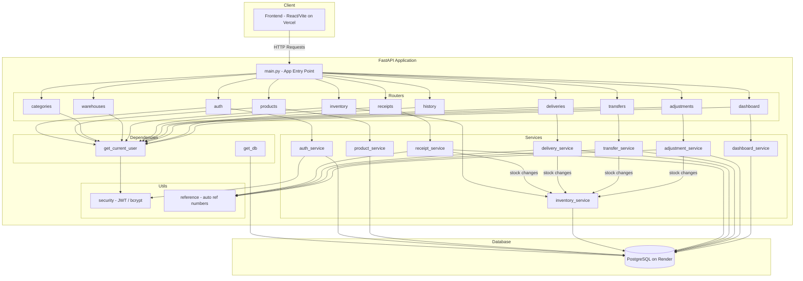
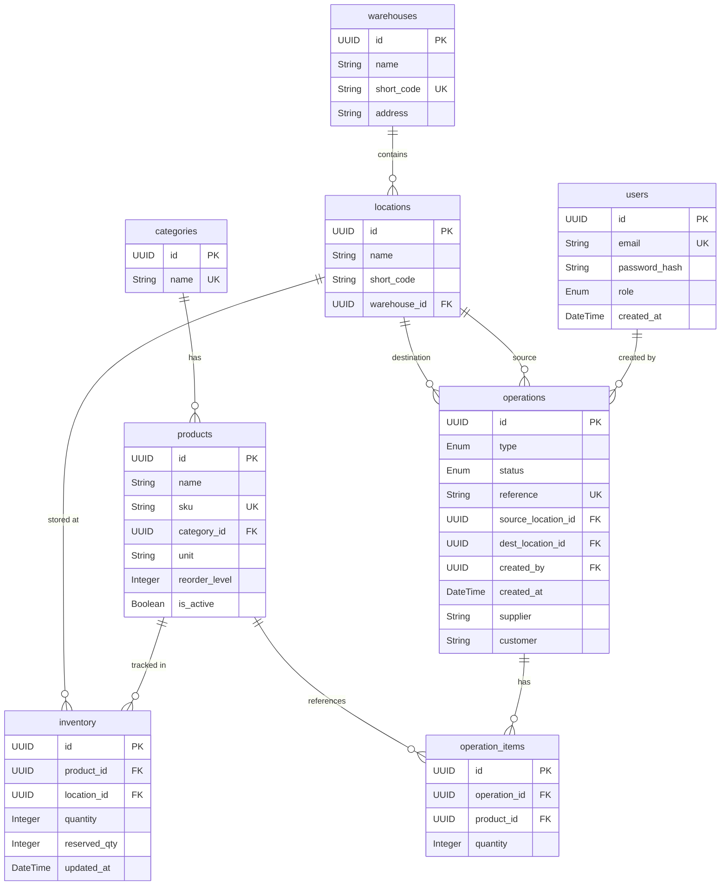

# CoreInventory — Inventory Management System

A full-stack, modular **Inventory Management System** for warehouse operations.

- **Backend**: FastAPI (Python) — deployed on [Render](https://render.com)
- **Frontend**: React + TypeScript + Vite — deployed on [Vercel](https://vercel.com)
- **Database**: PostgreSQL — hosted on Render

| Live URL | Link |
|----------|------|
| Frontend | https://core-inventory-odoo-xindus.vercel.app |
| Backend API | https://coreinventory-odooxindus.onrender.com |
| API Docs (Swagger) | https://coreinventory-odooxindus.onrender.com/docs |

---

## Features

- **Dashboard** — Real-time overview of inventory metrics and stock levels
- **Product Management** — Add, edit, and organize product catalogs with categories
- **Receipts & Deliveries** — Track incoming and outgoing goods with line items
- **Transfers** — Manage stock transfers between warehouse locations
- **Inventory Adjustments** — Record and track stock corrections
- **Move History** — Complete audit trail of all inventory movements
- **Warehouse & Locations** — Multi-warehouse support with zone/bin management
- **Authentication** — JWT-based signup, login, and password reset
- **Dark/Light Theme** — Built-in theme toggle

---

## Tech Stack

### Backend

| Component | Technology |
|-----------|-----------|
| Framework | FastAPI (Python) |
| Database | PostgreSQL |
| ORM | SQLAlchemy 2.0 |
| Migrations | Alembic |
| Auth | JWT (python-jose + passlib/bcrypt) |
| Validation | Pydantic v2 |
| Config | pydantic-settings + .env |

### Frontend

| Component | Technology |
|-----------|-----------|
| Framework | React 18 |
| Language | TypeScript |
| Build Tool | Vite 5 |
| Styling | Tailwind CSS 3 |
| UI Components | shadcn/ui + Radix UI |
| Routing | React Router 6 |
| State/Data | TanStack React Query |
| Charts | Recharts |
| Forms | React Hook Form + Zod |
| Notifications | Sonner |

---

## Monorepo Structure

```
CoreInventory/
├── backend/
│   ├── app/
│   │   ├── main.py                    # FastAPI entry point, CORS, routers
│   │   ├── config.py                  # Settings via pydantic-settings (.env)
│   │   ├── database.py                # SQLAlchemy engine, SessionLocal, Base
│   │   ├── models/                    # SQLAlchemy ORM models (1 file per table)
│   │   ├── schemas/                   # Pydantic v2 request/response models
│   │   ├── routers/                   # Route handlers (thin layer)
│   │   ├── services/                  # All business logic
│   │   ├── dependencies/              # get_current_user(), get_db()
│   │   └── utils/                     # JWT/bcrypt helpers, reference generator
│   ├── migrations/                    # Alembic migrations
│   │   └── versions/
│   ├── scripts/
│   │   └── seed.py                    # Database seed script with sample data
│   ├── alembic.ini
│   ├── requirements.txt
│   └── .env.example
│
├── frontend/
│   ├── src/
│   │   ├── components/                # Reusable UI components
│   │   │   └── ui/                    # shadcn/ui primitives
│   │   ├── hooks/                     # Custom React hooks
│   │   ├── lib/                       # API client, utilities, types
│   │   ├── pages/                     # Route-level page components
│   │   ├── test/                      # Test setup and test files
│   │   ├── App.tsx                    # Root component with routing
│   │   ├── main.tsx                   # Application entry point
│   │   └── index.css                  # Global styles & Tailwind config
│   ├── index.html
│   ├── vite.config.ts
│   ├── tailwind.config.ts
│   ├── package.json
│   └── .env.example
│
└── README.md                          # ← You are here
```

---

## Architecture



---

## Database Schema

> All primary keys are **UUID**. Timestamps use timezone-aware `DateTime`.



---

## API Endpoints

| Group | Method | Endpoint | Description |
|-------|--------|----------|-------------|
| **Auth** | POST | `/auth/signup` | Create user, return JWT |
| | POST | `/auth/login` | Login, return JWT |
| | POST | `/auth/reset-password` | Simple password reset |
| **Products** | GET | `/products` | List (filter: `category_id`, `search`) |
| | POST | `/products` | Create |
| | PUT | `/products/{id}` | Update |
| | DELETE | `/products/{id}` | Soft delete |
| **Categories** | GET | `/categories` | List all |
| | POST | `/categories` | Create |
| | DELETE | `/categories/{id}` | Delete |
| **Warehouses** | GET | `/warehouses` | List all |
| | POST | `/warehouses` | Create |
| | GET | `/warehouses/{id}/locations` | List locations |
| | POST | `/warehouses/{id}/locations` | Create location |
| **Inventory** | GET | `/inventory` | List (filter: `warehouse_id`, `location_id`, `product_id`) |
| | GET | `/inventory/low-stock` | Low stock items only |
| **Receipts** | GET | `/receipts` | List (filter: `status`) |
| | POST | `/receipts` | Create draft |
| | PUT | `/receipts/{id}/confirm` | Draft → Confirmed |
| | PUT | `/receipts/{id}/done` | Confirmed → Done (+stock) |
| | PUT | `/receipts/{id}/cancel` | Cancel |
| **Deliveries** | GET | `/deliveries` | List |
| | POST | `/deliveries` | Create draft |
| | PUT | `/deliveries/{id}/confirm` | Confirm |
| | PUT | `/deliveries/{id}/done` | Done (-stock, checks qty) |
| | PUT | `/deliveries/{id}/cancel` | Cancel |
| **Transfers** | GET | `/transfers` | List |
| | POST | `/transfers` | Create draft |
| | PUT | `/transfers/{id}/confirm` | Confirm |
| | PUT | `/transfers/{id}/done` | Done (source→dest) |
| | PUT | `/transfers/{id}/cancel` | Cancel |
| **Adjustments** | GET | `/adjustments` | List |
| | POST | `/adjustments` | Create draft |
| | PUT | `/adjustments/{id}/done` | Apply counted qty |
| **History** | GET | `/history` | Completed ops (filter: `type`, `date_from`, `date_to`) |
| **Dashboard** | GET | `/dashboard/kpis` | KPI summary |

> All endpoints except `/auth/signup` and `/auth/login` require a Bearer JWT token.

---

## Business Rules

- **Stock changes** go through `inventory_service` only — never update `inventory.quantity` from a router
- **Receipt done** → `+qty` at destination location
- **Delivery done** → checks stock ≥ requested qty, then `-qty` at source location
- **Transfer done** → checks source stock, then source `-qty` and dest `+qty`
- **Adjustment done** → sets `inventory.quantity = counted_qty`, logs delta
- **Status transitions**: `draft → confirmed → done` or `draft/confirmed → cancelled`
- **`free_to_use`** = `quantity - reserved_qty` (computed, never stored)
- **`is_low_stock`** = `quantity < reorder_level` (computed per response)

---

## Local Development Setup

### Prerequisites

| Requirement | Version |
|-------------|---------|
| Python | 3.10+ |
| Node.js | 18.0+ |
| npm | 9.0+ |
| PostgreSQL | 14+ |

### Backend Setup

```bash
# 1. Navigate to backend
cd backend

# 2. Create and activate virtual environment
python -m venv venv

# Windows PowerShell:
venv\Scripts\Activate.ps1
# Linux/macOS:
source venv/bin/activate

# 3. Install dependencies
pip install -r requirements.txt

# 4. Create .env file (copy from example)
cp .env.example .env
# Then edit .env with your DATABASE_URL and JWT_SECRET

# 5. Create the database
psql -U postgres -c "CREATE DATABASE coreinventory;"

# 6. Run migrations
alembic upgrade head

# 7. Seed sample data (optional)
python scripts/seed.py

# 8. Start the server
uvicorn app.main:app --reload
```

The backend runs at **http://localhost:8000**

**Swagger UI**: http://localhost:8000/docs

**Default login credentials (after seeding):**

| Email | Password | Role |
|-------|----------|------|
| rajesh.kumar@coreinventory.in | admin123 | Admin |
| priya.sharma@coreinventory.in | staff123 | Staff |
| amit.patel@coreinventory.in | staff123 | Staff |
| sneha.reddy@coreinventory.in | staff123 | Staff |
| vikram.singh@coreinventory.in | staff123 | Staff |

### Frontend Setup

```bash
# 1. Navigate to frontend
cd frontend

# 2. Install dependencies
npm install

# 3. Create .env.local (optional for local dev)
cp .env.example .env.local
# Edit VITE_API_URL if your backend is not on localhost:8000

# 4. Start dev server
npm run dev
```

The frontend runs at **http://localhost:8080**

---

## Environment Variables

### Backend (`backend/.env`)

| Variable | Description | Required |
|----------|-------------|----------|
| `DATABASE_URL` | PostgreSQL connection string | ✅ Yes |
| `JWT_SECRET` | Strong random string for signing JWTs | ✅ Yes |
| `JWT_ALGORITHM` | JWT algorithm (default: `HS256`) | No |
| `ACCESS_TOKEN_EXPIRE_MINUTES` | Token expiry in minutes (default: `1440`) | No |
| `FRONTEND_URL` | Vercel frontend URL for CORS | No |

### Frontend (`frontend/.env.local`)

| Variable | Description | Required |
|----------|-------------|----------|
| `VITE_API_URL` | Backend API base URL | ✅ Yes (production) |

> ⚠️ **Vite requires** the `VITE_` prefix. Variables without it are not exposed to client-side code.

---

## Production Deployment

### Backend → Render

1. Create a **Web Service** on Render, connect to this repo
2. Set **Root Directory** to `backend`
3. Set **Build Command** to `pip install -r requirements.txt`
4. Set **Start Command** to `uvicorn app.main:app --host 0.0.0.0 --port $PORT`
5. Add environment variables in the Render dashboard:

   | Variable | Value |
   |----------|-------|
   | `DATABASE_URL` | *(from Render PostgreSQL dashboard)* |
   | `JWT_SECRET` | *(generate with `openssl rand -hex 32`)* |
   | `JWT_ALGORITHM` | `HS256` |
   | `ACCESS_TOKEN_EXPIRE_MINUTES` | `1440` |
   | `FRONTEND_URL` | `https://core-inventory-odoo-xindus.vercel.app` |

6. Run migrations after first deploy: `alembic upgrade head`

### Frontend → Vercel

1. Import this repo on Vercel
2. Set **Root Directory** to `frontend`
3. Set **Build Command** to `npm run build` (auto-detected)
4. Add environment variable:

   | Variable | Value |
   |----------|-------|
   | `VITE_API_URL` | `https://coreinventory-odooxindus.onrender.com` |

---

## Available Scripts

### Backend

| Command | Description |
|---------|-------------|
| `uvicorn app.main:app --reload` | Start dev server |
| `alembic upgrade head` | Run all migrations |
| `alembic downgrade -1` | Rollback last migration |
| `alembic current` | Check migration status |
| `python scripts/seed.py` | Seed sample data |

### Frontend

| Command | Description |
|---------|-------------|
| `npm run dev` | Start dev server with HMR |
| `npm run build` | Build for production |
| `npm run preview` | Preview production build locally |
| `npm run lint` | Run ESLint |
| `npm run test` | Run tests with Vitest |
| `npm run test:watch` | Run tests in watch mode |

---

## Troubleshooting

### Backend

| Problem | Solution |
|---------|----------|
| `psycopg2-binary` fails to install | Upgrade pip: `pip install --upgrade pip` |
| `could not translate host name` | URL-encode special chars in password (e.g. `@` → `%40`) |
| `relation does not exist` | Run migrations: `alembic upgrade head` |
| Port 8000 in use | Use different port: `uvicorn app.main:app --reload --port 8001` |

### Frontend

| Problem | Solution |
|---------|----------|
| `npm install` fails | Ensure Node.js v18+, delete `node_modules/` and retry |
| Port 8080 in use | Vite auto-assigns next port, or edit `vite.config.ts` |
| TypeScript errors in IDE | Run `npm install` — TS needs `node_modules` for type resolution |
| Build errors | Clear Vite cache: `rm -rf node_modules/.vite && npm run build` |

---

## License

This project is licensed under the [MIT License](LICENSE).
