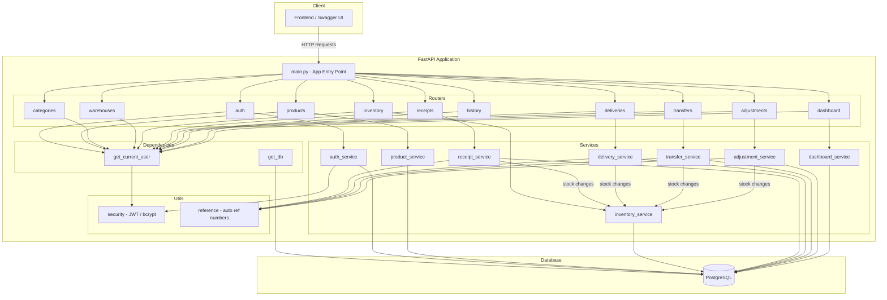
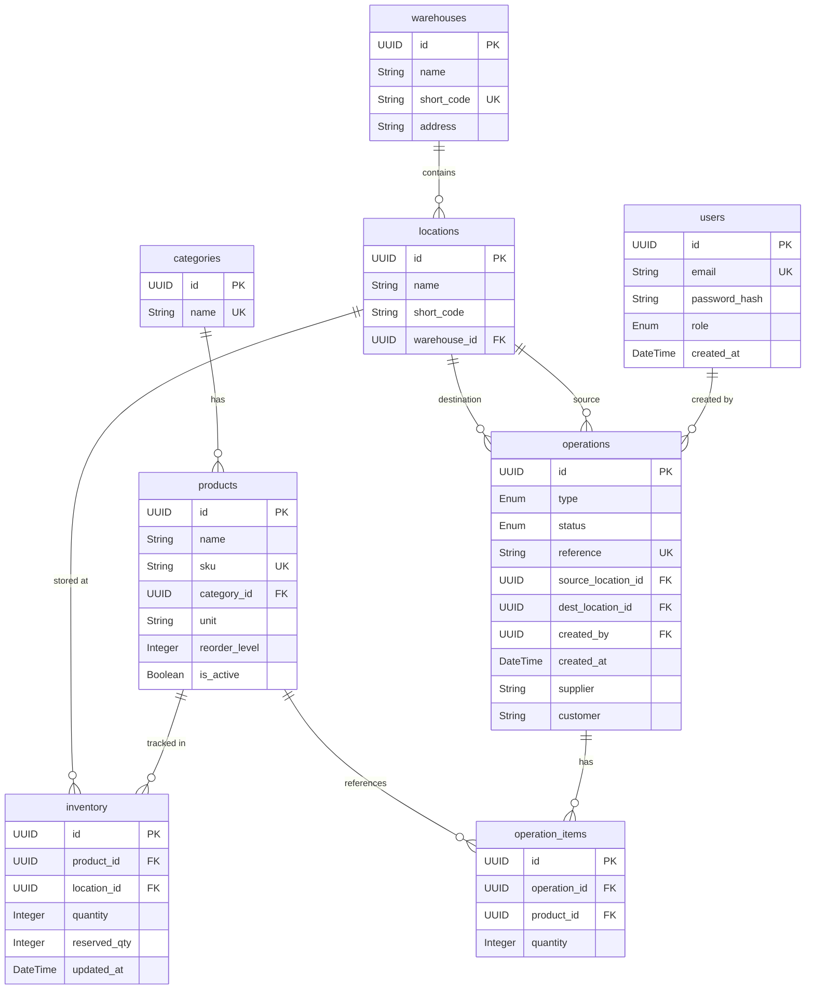

# CoreInventory — Inventory Management System

A modular **Inventory Management System** backend built with **FastAPI**, **PostgreSQL**, **SQLAlchemy**, and **JWT authentication**.

---

## Architecture Overview



---

## Folder Structure

```
backend/
├── app/
│   ├── main.py                    # FastAPI entry point, all routers registered
│   ├── config.py                  # Settings via pydantic-settings (.env)
│   ├── database.py                # SQLAlchemy engine, SessionLocal, Base
│   ├── models/                    # SQLAlchemy ORM models (1 file per table)
│   ├── schemas/                   # Pydantic v2 request/response models
│   ├── routers/                   # Route handlers (thin layer, no business logic)
│   ├── services/                  # All business logic lives here
│   ├── dependencies/              # get_current_user(), get_db()
│   └── utils/                     # JWT/bcrypt helpers, reference number generator
├── migrations/                    # Alembic migrations
│   ├── env.py
│   ├── script.py.mako
│   └── versions/
│       └── 001_initial_schema.py
├── scripts/
│   └── seed.py                    # Database seed script with sample data
├── .env                           # Environment variables (never commit)
├── alembic.ini
├── requirements.txt
└── README.md
```

---

## Database Schema — 8 Tables

> All primary keys are **UUID**. Timestamps use timezone-aware `DateTime`.

### `users`
| Column | Type | Constraints |
|--------|------|-------------|
| id | UUID | PK |
| email | String | UNIQUE, NOT NULL |
| password_hash | String | NOT NULL |
| role | Enum(`admin`, `staff`) | NOT NULL, default `staff` |
| created_at | DateTime | auto |

### `categories`
| Column | Type | Constraints |
|--------|------|-------------|
| id | UUID | PK |
| name | String | UNIQUE, NOT NULL |

### `products`
| Column | Type | Constraints |
|--------|------|-------------|
| id | UUID | PK |
| name | String | NOT NULL |
| sku | String | UNIQUE, NOT NULL |
| category_id | UUID | FK → `categories.id`, nullable |
| unit | String | NOT NULL, default `pcs` |
| reorder_level | Integer | NOT NULL, default `0` |
| is_active | Boolean | NOT NULL, default `true` |

### `warehouses`
| Column | Type | Constraints |
|--------|------|-------------|
| id | UUID | PK |
| name | String | NOT NULL |
| short_code | String | UNIQUE, NOT NULL |
| address | String | nullable |

### `locations`
| Column | Type | Constraints |
|--------|------|-------------|
| id | UUID | PK |
| name | String | NOT NULL |
| short_code | String | NOT NULL |
| warehouse_id | UUID | FK → `warehouses.id`, NOT NULL |

### `inventory`
| Column | Type | Constraints |
|--------|------|-------------|
| id | UUID | PK |
| product_id | UUID | FK → `products.id`, NOT NULL |
| location_id | UUID | FK → `locations.id`, NOT NULL |
| quantity | Integer | NOT NULL, default `0` |
| reserved_qty | Integer | NOT NULL, default `0` |
| updated_at | DateTime | auto-updated |

> **Unique constraint:** `(product_id, location_id)`  
> **Computed field (not stored):** `free_to_use = quantity - reserved_qty`

### `operations`
| Column | Type | Constraints |
|--------|------|-------------|
| id | UUID | PK |
| type | Enum(`receipt`, `delivery`, `transfer`, `adjustment`) | NOT NULL |
| status | Enum(`draft`, `confirmed`, `done`, `cancelled`) | NOT NULL, default `draft` |
| reference | String | UNIQUE, NOT NULL, auto-generated |
| source_location_id | UUID | FK → `locations.id`, nullable |
| dest_location_id | UUID | FK → `locations.id`, nullable |
| created_by | UUID | FK → `users.id`, NOT NULL |
| created_at | DateTime | auto |
| supplier | String | nullable (for receipts) |
| customer | String | nullable (for deliveries) |

### `operation_items`
| Column | Type | Constraints |
|--------|------|-------------|
| id | UUID | PK |
| operation_id | UUID | FK → `operations.id`, NOT NULL |
| product_id | UUID | FK → `products.id`, NOT NULL |
| quantity | Integer | NOT NULL |

---

## ER Diagram



---

## API Endpoints

| Group | Method | Endpoint | Description |
|-------|--------|----------|-------------|
| **Auth** | POST | `/auth/signup` | Create user, return JWT |
| | POST | `/auth/login` | Login, return JWT |
| | POST | `/auth/reset-password` | Simple password reset |
| **Products** | GET | `/products` | List (filter: `category_id`, `search`) |
| | POST | `/products` | Create |
| | PUT | `/products/{id}` | Update |
| | DELETE | `/products/{id}` | Soft delete |
| **Categories** | GET | `/categories` | List all |
| | POST | `/categories` | Create |
| | DELETE | `/categories/{id}` | Delete |
| **Warehouses** | GET | `/warehouses` | List all |
| | POST | `/warehouses` | Create |
| | GET | `/warehouses/{id}/locations` | List locations |
| | POST | `/warehouses/{id}/locations` | Create location |
| **Inventory** | GET | `/inventory` | List (filter: `warehouse_id`, `location_id`, `product_id`) |
| | GET | `/inventory/low-stock` | Low stock items only |
| **Receipts** | GET | `/receipts` | List (filter: `status`) |
| | POST | `/receipts` | Create draft |
| | PUT | `/receipts/{id}/confirm` | Draft → Confirmed |
| | PUT | `/receipts/{id}/done` | Confirmed → Done (+stock) |
| | PUT | `/receipts/{id}/cancel` | Cancel |
| **Deliveries** | GET | `/deliveries` | List |
| | POST | `/deliveries` | Create draft |
| | PUT | `/deliveries/{id}/confirm` | Confirm |
| | PUT | `/deliveries/{id}/done` | Done (-stock, checks qty) |
| | PUT | `/deliveries/{id}/cancel` | Cancel |
| **Transfers** | GET | `/transfers` | List |
| | POST | `/transfers` | Create draft |
| | PUT | `/transfers/{id}/confirm` | Confirm |
| | PUT | `/transfers/{id}/done` | Done (source→dest) |
| | PUT | `/transfers/{id}/cancel` | Cancel |
| **Adjustments** | GET | `/adjustments` | List |
| | POST | `/adjustments` | Create draft |
| | PUT | `/adjustments/{id}/done` | Apply counted qty |
| **History** | GET | `/history` | Completed ops (filter: `type`, `date_from`, `date_to`) |
| **Dashboard** | GET | `/dashboard/kpis` | KPI summary |

> All endpoints except `/auth/signup` and `/auth/login` require a Bearer JWT token.

---

## Business Rules

- **Stock changes** go through `inventory_service` only — never update `inventory.quantity` from a router.
- **Receipt done** → `+qty` at destination location
- **Delivery done** → checks stock ≥ requested qty, then `-qty` at source location
- **Transfer done** → checks source stock, then source `-qty` and dest `+qty`
- **Adjustment done** → sets `inventory.quantity = counted_qty`, logs delta
- **Status transitions**: `draft → confirmed → done` or `draft/confirmed → cancelled`
- **`free_to_use`** = `quantity - reserved_qty` (computed, never stored)
- **`is_low_stock`** = `quantity < reorder_level` (computed per response)

---

## Tech Stack

| Component | Technology |
|-----------|-----------|
| Backend | FastAPI (Python) |
| Database | PostgreSQL |
| ORM | SQLAlchemy 2.0 |
| Migrations | Alembic |
| Auth | JWT (python-jose + passlib/bcrypt) |
| Validation | Pydantic v2 |
| Config | pydantic-settings + .env |
